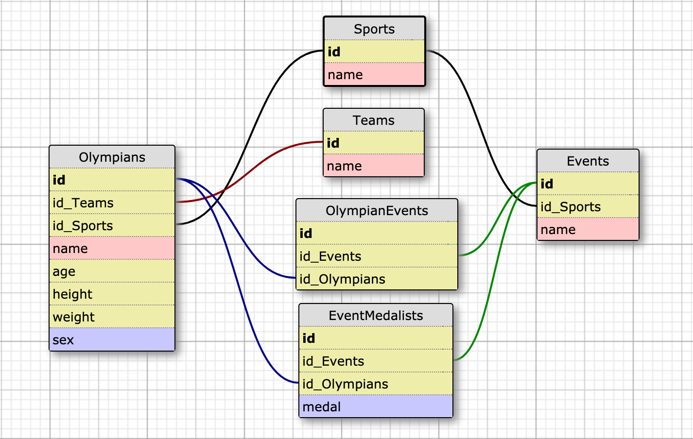

# Elixir Koroibos

A recreation of the Koroibos challenge, used to emulate a two day long take home challenge. Originally completed as a part of the Turing School of Software & Design curriculum, this recreation is being used primarily to refine skills of testing, documentation, and general competency when using Elixir and the Phoenix Framework.

The application provides an API for tracking information on olympians, events, and statistics from the Olympic games. Documentation for available endpoints can be found [here](#endpoints).

The original specifications for the project are provided within this README and can be found [here](#originalrequirements)

## Getting Started

#### Dependencies
The application requires the follwing dependencies to be installed:
- Elixir 1.8.2 / OTP 21
- Phoenix 1.4.8
- PostgreSQL 11.1

#### Setup

To perform of the initial setup of the application, run the following:
``` bash
mix deps.get
mix ecto.create
mix ecto.migrate
```

This will fetch the required dependencies for the application and prepare the database.

#### Starting the Application

To start the application locally, use the command `mix phx.server`. The application will be started and listen on port 4000 by default.

Shut down the application by pressing `ctrl+c`.

## Testing

The application comes with a test suite for the provided endpoints and models. To execute the test suite, use the command `mix test`.

## Schema Design



## Endpoints

### GET /api/v1/olympians

Provides a list of all olympians in the system with the following information:

- The name of the Olympian
- The age of the Olympian
- The name of the team the Olympian represents
- The name of the sport the Olympian is participating in
- The total medals won by the olympian

Sample response:
``` JSON
{
  "olympians": [
    {
      "name": "Olympian 1",
      "age": 20,
      "sport": "Swimming",
      "team": "USA",
      "total_medals_won": 2
    },
    {
      "name": "Olympian 2",
      "age": 18,
      "sport": "Taekwondo",
      "team": "South Korea",
      "total_medals_won": 4
    }
  ]
}
```

Additionally, the endpoint accepts an optional parameter, `age`, with the values of either `youngest` or `oldest`. When passed, the endpoint will only return the youngest or oldest olympian in the system in the array of olympians.

### GET /api/v1/olympian_stats

Provides statistical information regarding the olympians within the application, including the following information:

- The total count of olympians within the application
- The average weight of olympians by sex
- The average age of all olympians

Sample response:
``` JSON
{
  "olympian_stats": {
    "total_competing_olympians": 3062,
    "average_weight": {
      "unit": "kg",
      "male_olympians": 75.4,
      "female_olympians": 70.2
    },
    "average_age": 26.3
  }
}
```

### GET /api/v1/events

Provides a list of all events in the system, grouped by the sport that the event is affiliated with. This endpoint was adjusted from the original specifications following discussion with the project managaer and noting that the event_medalist endpoint requires the event IDs in order to access, but that the implementation requested did not provide this information. Following this discussion, this endpoint now provides the following information:

- The name of the sport
- The events under that sport, including the id, and the name

Sample response:
``` JSON
{
  "events": [
    {
      "sport": "Taekwondo",
      "events": [
        {
          "id": 1,
          "name": "Sparring"
        }
      ]
    },
    {
      "sport": "Swimming",
      "events": [
        {
          "id": 5,
          "name": "100M Freestyle"
        },
        {
          "id": 9,
          "name": "100M Backstroke"
        }
      ]
    }
  ]
}
```

### GET /api/v1/events/:id/medalists

Provides the name of the event associated with the `id` provided, with a list of all medalists from the event. Medalist information includes the following:

- Name of the medalist
- Age of the medalist
- Name of the team the medalist represents
- The medal awarded to the medalist

Sample response:
``` JSON
{
  "event": "Badminton Mixed Doubles",
  "medalists": [
      {
        "name": "Tontowi Ahmad",
        "team": "Indonesia-1",
        "age": 29,
        "medal": "Gold"
      },
      {
        "name": "Chan Peng Soon",
        "team": "Malaysia",
        "age": 28,
        "medal": "Silver"
      }
    ]
}
```

In the event that an invalid `id` is provided, the endpoint returns a `404` status code as well as an error message indicating the event was unable to be located.

``` JSON
{
  "error": "Event not found"
}
```

## Original Requirements

(Requirements Originally found [here](https://github.com/dionew1/backend-curriculum-site/blob/gh-pages/module4/projects/take_home_challenge/prompts/olympic_spec.md))

Thank you for taking the time to apply to our Junior Developer position here at Koroibos. Our company is currently working to build a live Olympic Analytics tracker for the 2020 Summer Games. As part of our application, we want to include historical data from the 2016 Summer Olympics. We have provided you a sample of the data [here](https://github.com/dionew1/backend-curriculum-site/blob/gh-pages/module4/projects/take_home_challenge/prompts/olympic_data_2016.csv). For your technical challenge, we would like to see you use this data to build out some analytical endpoints using Node and Express. We have provided specifications for the endpoints that we are looking for, and would love to see your initiative for any other endpoints you think could provide interesting data analysis. We will meet on Wednesday to discuss your process, decisions, and code quality. Looking forward to our review!

Endpoint Specifications

* `GET api/v1/olympians`

```javascript
//Response Format
{
  "olympians":
    [
      {
        "name": "Maha Abdalsalam",
        "team": "Egypt",
        "age": 18,
        "sport": "Diving"
        "total_medals_won": 0
      },
      {
        "name": "Ahmad Abughaush",
        "team": "Jordan",
        "age": 20,
        "sport": "Taekwondo"
        "total_medals_won": 1
      },
      {...}
    ]
}
```

* `GET api/v1/olympians?age=youngest`

```javascript
//Response Format
{
  "olympians": [
    {
      "name": "Ana Iulia Dascl",
      "team": "Romania",
      "age": 13,
      "sport": "Swimming"
      "total_medals_won": 0
    }
  ]
}
```

* `GET api/v1/olympians?age=oldest`

```javascript
//Response Format
{
  "olympians": [
    {
      "name": "Julie Brougham",
      "team": "New Zealand",
      "age": 62,
      "sport": "Equestrianism"
      "total_medals_won": 0
    }
  ]
}
```

* `GET api/v1/olympian_stats`

```javascript
  {
    "olympian_stats": {
      "total_competing_olympians": 3120
      "average_weight:" {
        "unit": "kg",
        "male_olympians": 75.4,
        "female_olympians": 70.2
      }
      "average_age:" 26.2
    }
  }
```

* `GET api/v1/events`

```javascript
//Response Format
{
  "events":
    [
      {
        "sport": "Archery",
        "events": [
          "Archery Men's Individual",
          "Archery Men's Team",
          "Archery Women's Individual",
          "Archery Women's Team"
        ]
      },
      {
        "sport": "Badminton",
        "events": [
          "Badminton Men's Doubles",
          "Badminton Men's Singles",
          "Badminton Women's Doubles",
          "Badminton Women's Singles",
          "Badminton Mixed Doubles"
        ]
      },
      {...}
    ]
}
```

* `GET api/v1/events/:id/medalists`

_This is sample data and it is incomplete. You may not have all medalists for a particular event._

```javascript
//Response Format
{
  "event": "Badminton Mixed Doubles",
  "medalists": [
      {
        "name": "Tontowi Ahmad",
        "team": "Indonesia-1",
        "age": 29,
        "medal": "Gold"
      },
      {
        "name": "Chan Peng Soon",
        "team": "Malaysia",
        "age": 28,
        "medal": "Silver"
      }
    ]
}
```
